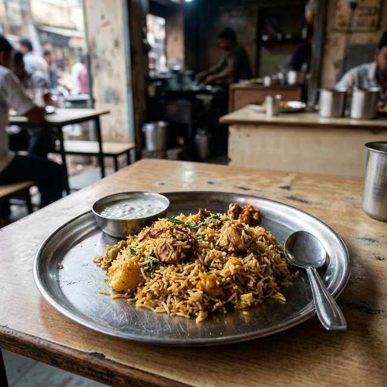

# 🔥 Bhuk Lagi (Hungry But Broke?)

**Bhuk Lagi** is a professional-grade budget food aggregator designed for students and workers who want to find the cheapest food options near them. It compares prices across multiple online delivery platforms (Zomato, Swiggy, Blinkit, etc.) and combines them with local offline restaurant data to ensure you never sleep hungry.


## 🎯 Key Features

-   **Tiered Pricing Visualization**: Automatically categorizes food into 🟢 Budget, 🟡 Mid-Range, and 🔴 Premium tiers with dynamic image swapping based on price.
-   **Platform Comparison**: Compare the same dish across Zomato, Swiggy, Magicpin, and local dhabas in one view.
-   **Deep Linking**: One-click "Order Now" buttons that take you directly to the search results on major food apps.
-   **Savings Meter**: An interactive calculator to track how much you save monthly by choosing budget options.
-   **Glassmorphism UI**: A dark-themed, modern interface built with premium aesthetics and smooth micro-animations.
-   **Geo-Location Search**: Finds street stalls and restaurants within walking distance (0.1km to 5km).

## 🚀 Tech Stack

-   **Frontend**: Semantic HTML5, CSS3 (Custom Design System), JavaScript (ES6+).
-   **Design**: Glassmorphism, CSS Gradients, and responsive layouts.
-   **APIs**: Geolocation API for proximity-based search.
-   **Data Model**: Extensible platform-centric menu mapping.

## 📸 Screenshots

| Budget Tier (Roadside) | Premium Tier (Fine Dining) |
| :--- | :--- |
|  |  |

## 🛠️ Installation & Setup

1.  Clone the repository:
    ```bash
    git clone https://github.com/yug1204/BHUK-LAGI.git
    ```
2.  Open `index.html` in your browser.
3.  No server or backend required — it's built for maximum performance as a PWA-ready frontend.


---
Made with ❤️ in India by **Yug**
